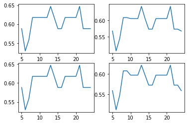
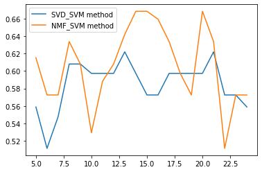

# 0.前期准备

**1700011044 张灏宇**


```python
## import packages which we need
import numpy as np
import pandas as pd
import matplotlib.pyplot as plt
import sys
import os
%matplotlib inline 
```


```python
## python env
import sys
print(sys.version)
```

    3.8.5 (default, Sep  4 2020, 07:30:14) 
    [GCC 7.3.0]


### 0.1 任务说明

本任务的目的是基于一些病人的基因表达的数据集，对患**acute myeloid leukemia (AML)**和**acute lymphoblastic leukemia (ALL)**的病人进行区分。因为病人数仅仅几十个，而基因表达的数据纬度达到几千，样本数和特征纬度数量级上的差异会导致直接利用分类方法在原始数据纬度下进行训练效果很差，因此需要利用数据降维方法提取重要的特征纬度，将原始数据降维再训练。本项目将比较利用**NMF**和**SVD**分解方法分别进行降维处理后进行分类，比较两降维方法的效果和特征提取的能力。

### 0.2 数据集导入

因为数据集太⼤大，因此不不随着作业上传到教学平台，仅仅上传代码和报告部分。另开设了了⼀一个githup仓
库上传了了整个项⽬目。  

githup⽹网址：https://github.com/zhanghaoyu9931/mathematics_model_porj2


```python
## read dataset
sys.path.append('../data')
train_data = pd.read_csv('../data/data_set_ALL_AML_train.csv')
test_data = pd.read_csv('../data/data_set_ALL_AML_independent.csv')
labels = pd.read_csv('../data/actual.csv')

## take a look at the data
print('There are gene expression data of {} patients.\
'.format(labels.shape[0]))
train_data.head()
```

    There are gene expression data of 72 patients.

数据集表格的一部分预览：

<table border="1" class="dataframe">
  <thead>
    <tr style="text-align: right;">
      <th></th>
      <th>Gene Description</th>
      <th>Gene Accession Number</th>
      <th>1</th>
      <th>call</th>
      <th>2</th>
      <th>call.1</th>
      <th>3</th>
      <th>call.2</th>
      <th>4</th>
      <th>call.3</th>
      <th>...</th>
      <th>29</th>
      <th>call.33</th>
      <th>30</th>
      <th>call.34</th>
      <th>31</th>
      <th>call.35</th>
      <th>32</th>
      <th>call.36</th>
      <th>33</th>
      <th>call.37</th>
    </tr>
  </thead>
  <tbody>
    <tr>
      <th>0</th>
      <td>AFFX-BioB-5_at (endogenous control)</td>
      <td>AFFX-BioB-5_at</td>
      <td>-214</td>
      <td>A</td>
      <td>-139</td>
      <td>A</td>
      <td>-76</td>
      <td>A</td>
      <td>-135</td>
      <td>A</td>
      <td>...</td>
      <td>15</td>
      <td>A</td>
      <td>-318</td>
      <td>A</td>
      <td>-32</td>
      <td>A</td>
      <td>-124</td>
      <td>A</td>
      <td>-135</td>
      <td>A</td>
    </tr>
    <tr>
      <th>1</th>
      <td>AFFX-BioB-M_at (endogenous control)</td>
      <td>AFFX-BioB-M_at</td>
      <td>-153</td>
      <td>A</td>
      <td>-73</td>
      <td>A</td>
      <td>-49</td>
      <td>A</td>
      <td>-114</td>
      <td>A</td>
      <td>...</td>
      <td>-114</td>
      <td>A</td>
      <td>-192</td>
      <td>A</td>
      <td>-49</td>
      <td>A</td>
      <td>-79</td>
      <td>A</td>
      <td>-186</td>
      <td>A</td>
    </tr>
    <tr>
      <th>2</th>
      <td>AFFX-BioB-3_at (endogenous control)</td>
      <td>AFFX-BioB-3_at</td>
      <td>-58</td>
      <td>A</td>
      <td>-1</td>
      <td>A</td>
      <td>-307</td>
      <td>A</td>
      <td>265</td>
      <td>A</td>
      <td>...</td>
      <td>2</td>
      <td>A</td>
      <td>-95</td>
      <td>A</td>
      <td>49</td>
      <td>A</td>
      <td>-37</td>
      <td>A</td>
      <td>-70</td>
      <td>A</td>
    </tr>
    <tr>
      <th>3</th>
      <td>AFFX-BioC-5_at (endogenous control)</td>
      <td>AFFX-BioC-5_at</td>
      <td>88</td>
      <td>A</td>
      <td>283</td>
      <td>A</td>
      <td>309</td>
      <td>A</td>
      <td>12</td>
      <td>A</td>
      <td>...</td>
      <td>193</td>
      <td>A</td>
      <td>312</td>
      <td>A</td>
      <td>230</td>
      <td>P</td>
      <td>330</td>
      <td>A</td>
      <td>337</td>
      <td>A</td>
    </tr>
    <tr>
      <th>4</th>
      <td>AFFX-BioC-3_at (endogenous control)</td>
      <td>AFFX-BioC-3_at</td>
      <td>-295</td>
      <td>A</td>
      <td>-264</td>
      <td>A</td>
      <td>-376</td>
      <td>A</td>
      <td>-419</td>
      <td>A</td>
      <td>...</td>
      <td>-51</td>
      <td>A</td>
      <td>-139</td>
      <td>A</td>
      <td>-367</td>
      <td>A</td>
      <td>-188</td>
      <td>A</td>
      <td>-407</td>
      <td>A</td>
    </tr>
  </tbody>
</table>
<p>5 rows × 78 columns</p>
对于训练和测试数据，每列代表一个病人的基因表达情况，第一行为基因的描述信息，第二行为基因编号。每一个病人的每个基因有一个表达数值，为**int**，以及基因的表达水平，为一个字符，分别为{A:absent, P:present, M:marginal}。


```python
## explain the call

call_values = train_data['call'].unique()
print('Values for call columns contain: {}'.format(call_values))
```

    Values for call columns contain: ['A' 'P' 'M']


# 1.数预处理及降维

该部分包含原始数据的基因表达处理为熟悉的格式（去掉call列等）以及利用NMF、SVD两种不同方法对数据进行特征纬度降低。


```python
# remove columns that contain Call data
from preprocess import *

train_X = data_process_X(train_data)
test_X = data_process_X(test_data)

## to accomplish that every elements of array is nonnegative
train_X -= train_X.min()
test_X -= test_X.min()

train_X.head()
```

<table border="1" class="dataframe">
  <thead>
    <tr style="text-align: right;">
      <th>Gene Accession Number</th>
      <th>AFFX-BioB-5_at</th>
      <th>AFFX-BioB-M_at</th>
      <th>AFFX-BioB-3_at</th>
      <th>AFFX-BioC-5_at</th>
      <th>AFFX-BioC-3_at</th>
      <th>AFFX-BioDn-5_at</th>
      <th>AFFX-BioDn-3_at</th>
      <th>AFFX-CreX-5_at</th>
      <th>AFFX-CreX-3_at</th>
      <th>AFFX-BioB-5_st</th>
      <th>...</th>
      <th>U48730_at</th>
      <th>U58516_at</th>
      <th>U73738_at</th>
      <th>X06956_at</th>
      <th>X16699_at</th>
      <th>X83863_at</th>
      <th>Z17240_at</th>
      <th>L49218_f_at</th>
      <th>M71243_f_at</th>
      <th>Z78285_f_at</th>
    </tr>
  </thead>
  <tbody>
    <tr>
      <th>1</th>
      <td>262</td>
      <td>174</td>
      <td>249</td>
      <td>124</td>
      <td>246</td>
      <td>232</td>
      <td>678</td>
      <td>287</td>
      <td>334</td>
      <td>421</td>
      <td>...</td>
      <td>155</td>
      <td>287</td>
      <td>53</td>
      <td>353</td>
      <td>75</td>
      <td>598</td>
      <td>288</td>
      <td>86</td>
      <td>193</td>
      <td>57</td>
    </tr>
    <tr>
      <th>2</th>
      <td>337</td>
      <td>254</td>
      <td>306</td>
      <td>319</td>
      <td>277</td>
      <td>390</td>
      <td>149</td>
      <td>295</td>
      <td>183</td>
      <td>289</td>
      <td>...</td>
      <td>139</td>
      <td>613</td>
      <td>142</td>
      <td>406</td>
      <td>95</td>
      <td>587</td>
      <td>254</td>
      <td>61</td>
      <td>78</td>
      <td>80</td>
    </tr>
    <tr>
      <th>3</th>
      <td>400</td>
      <td>278</td>
      <td>0</td>
      <td>345</td>
      <td>165</td>
      <td>140</td>
      <td>512</td>
      <td>96</td>
      <td>288</td>
      <td>0</td>
      <td>...</td>
      <td>285</td>
      <td>975</td>
      <td>211</td>
      <td>132</td>
      <td>164</td>
      <td>943</td>
      <td>736</td>
      <td>91</td>
      <td>230</td>
      <td>53</td>
    </tr>
    <tr>
      <th>4</th>
      <td>341</td>
      <td>213</td>
      <td>572</td>
      <td>48</td>
      <td>122</td>
      <td>205</td>
      <td>637</td>
      <td>210</td>
      <td>131</td>
      <td>246</td>
      <td>...</td>
      <td>210</td>
      <td>611</td>
      <td>396</td>
      <td>138</td>
      <td>2</td>
      <td>432</td>
      <td>129</td>
      <td>0</td>
      <td>128</td>
      <td>3</td>
    </tr>
    <tr>
      <th>5</th>
      <td>370</td>
      <td>202</td>
      <td>231</td>
      <td>204</td>
      <td>311</td>
      <td>506</td>
      <td>483</td>
      <td>341</td>
      <td>152</td>
      <td>467</td>
      <td>...</td>
      <td>126</td>
      <td>425</td>
      <td>235</td>
      <td>468</td>
      <td>86</td>
      <td>55</td>
      <td>273</td>
      <td>64</td>
      <td>58</td>
      <td>69</td>
    </tr>
  </tbody>
</table>
<p>5 rows × 7129 columns</p>


### 1.1 SVD分解

SVD分解进行数据降维的基本原理是对于原始矩阵$A_{m*n}$，要对矩阵进行分解得到$A_{m*n} = U_{m*k}\Sigma_{k*k}V^{T}_{n*k}$，其中k为希望降低到的**特征纬度**，满足$k<rank(A)$。其中U为左奇异矩阵，由$A*A^T$的k个**正交单位**特征向量组成，V为右奇异矩阵，由$A^T*A$的k个**正交单位**特征向量组成，满足$U*U^T=I_{m*m}$，$V*V^T=I_{n*n}$。$\Sigma_{k*k}$为对角矩阵，对角线元素$A*A^T$的前$k$个特征值开根号。$X^{reduction}_{m*k}=A_{m*n}*V_{n*k}$为变换到降维空间后的数据集。


```python
import numpy as np
import pandas as pd
import matplotlib.pyplot as plt
from sklearn.preprocessing import LabelEncoder, StandardScaler
from sklearn.metrics import accuracy_score, mean_absolute_error


def svd_decomp(A, k):
    # obtain svd
    A = np.array(A)
    U, S, V = np.linalg.svd(A)

    # inspect shapes of the matrices
    print(U.shape, S.shape, V.shape)
    
    A_recover = U[:, :k] @ np.diag(S[:k]) @ (V[:k, :])
    transfer = V[:k, :].T
#     print(np.abs(A - A_decomp).sum()/(A.shape[0]*A.shape[1]))
    return A_recover, transfer
    
def svd_trans(data, trans):
    ## translate to reduction space from original data
    return data@trans
   
SVD_train_list = []
SVD_test_list = []
## default range from 10-20
for i in range(5, 25):
    train_A = train_X.copy()
    train_A = np.array(train_A)
    test_A = test_X.copy()
    test_A = np.array(test_A)
    
    A_recover, trans = svd_decomp(train_A, i)
    
    ## translate
    train_decom = svd_trans(train_A, trans)
    test_decom = svd_trans(test_A, trans)
    
    scaler = StandardScaler()
    train_decom = scaler.fit_transform(train_decom)
    test_decom = scaler.fit_transform(test_decom)
    
    SVD_train_list.append(train_decom)
    SVD_test_list.append(test_decom)
#     print(train_decom.shape, test_decom.shape)

```

    (38, 38) (38,) (7129, 7129)
    (38, 38) (38,) (7129, 7129)
    (38, 38) (38,) (7129, 7129)
    (38, 38) (38,) (7129, 7129)
    (38, 38) (38,) (7129, 7129)
    (38, 38) (38,) (7129, 7129)
    (38, 38) (38,) (7129, 7129)
    (38, 38) (38,) (7129, 7129)
    (38, 38) (38,) (7129, 7129)
    (38, 38) (38,) (7129, 7129)
    (38, 38) (38,) (7129, 7129)
    (38, 38) (38,) (7129, 7129)
    (38, 38) (38,) (7129, 7129)
    (38, 38) (38,) (7129, 7129)
    (38, 38) (38,) (7129, 7129)
    (38, 38) (38,) (7129, 7129)
    (38, 38) (38,) (7129, 7129)
    (38, 38) (38,) (7129, 7129)
    (38, 38) (38,) (7129, 7129)
    (38, 38) (38,) (7129, 7129)


### 1.2 NMF降维

非负矩阵分解NMF也可用于矩阵降维，表示为$A_{m*n}=H_{m*k}*W_{k*n}$其中H为权重矩阵，每行元素为降维后的特征向量，而W的每一行表示降维后的空间每个单位向量是由原来n维空间的单位向量的线性组合而来。因此降维后的每一个单位向量都是原来空间单位向量的非负线性组合。


```python
from sklearn import decomposition

nmf_decom = decomposition.NMF(n_components=6, init='nndsvda', tol=5e-3)

NMF_train_list = []
NMF_test_list = []

for i in range(5, 25):
    nmf_decom = decomposition.NMF(n_components=i, init='nndsvda', tol=5e-3)
    
    train_A = train_X.copy()
    train_A = np.array(train_A)
    test_A = test_X.copy()
    test_A = np.array(test_A)
    
    nmf_decom.fit(train_A)
    train_decom = nmf_decom.transform(train_A)
    test_decom = nmf_decom.transform(test_A)
    
    scaler = StandardScaler()
    train_decom = scaler.fit_transform(train_decom)
    test_decom = scaler.fit_transform(test_decom)
    
    NMF_test_list.append(test_decom)
    NMF_train_list.append(train_decom)
    
    
```

### 1.3 Label数据处理和训练测试集构建


将原本是str类型的label数据变为可以训练的数字数据。


```python
## translate label to number from str
l_encoder = LabelEncoder()
labels['CancerColumn'] = l_encoder.fit_transform(labels['cancer'])

print('\n--- Cancer types before label encoding: \n', labels['cancer'].unique())

print('\n--- Cancer types after label encoding: \n', labels['CancerColumn'].unique())
## drop the 'cancer' column
labels = labels.drop('cancer', axis = 1)
```


    --- Cancer types before label encoding: 
     ['ALL' 'AML']
    
    --- Cancer types after label encoding: 
     [0 1]

label数据处理：

```python
## construct labels for train and test

train_y = labels[labels.patient <= 38].reset_index(drop=True)
test_y = labels[labels.patient > 38].reset_index(drop=True)

train_y = train_y.iloc[:,1]
train_y = np.array(train_y)
test_y = test_y.iloc[:,1]
test_y = np.array(test_y)
```

# 2.SVM算法进行二分类

### 2.1 对于SVD分解降维的数据进行分类。


```python
from sklearn import svm
from sklearn.model_selection import GridSearchCV
from Metrics import *

accuracy = []
precise = []
recall = []
f1 = []

## find best parameter

for (X_train, X_test) in zip(SVD_train_list, SVD_test_list):
    print('**Now data of {} features are processing.\n'.format(X_train.shape[1]))
    ## Y label
    Y_train = train_y
    Y_test = test_y
    
    SVM_clf = svm.SVC(class_weight='balanced', probability=True)
    search_space = {'C': np.logspace(-3, 3, 5)}
    gridsearch = GridSearchCV(SVM_clf, param_grid=search_space, scoring='f1_macro', refit=True, cv=10, n_jobs=-1)
    gridsearch.fit(X_train,Y_train)

    SVM_clf = gridsearch.best_estimator_
    SVM_clf.fit(X_train, Y_train)
    
    h_a, h_p, h_r, h_f = print_metrics(SVM_clf, X_test, Y_test)
    
    accuracy.append(h_a)
    precise.append(h_p)
    recall.append(h_r)
    f1.append(h_f)
```

    **Now data of 5 features are processing.
    
    Confusion matrix
    
    Predicted   0  1
    Actual          
    0          16  4
    1          10  4
    accuracy = 0.588 
    precision = 0.568 
    recall = 0.588 
    f1 = 0.559
    **Now data of 6 features are processing.
    
    Confusion matrix
    
    Predicted   0  1
    Actual          
    0          14  6
    1          10  4
    accuracy = 0.529 
    precision = 0.508 
    recall = 0.529 
    f1 = 0.512

结果可视化如下：

```python
## visulization of the result

feature_num = range(5, 25)
plt.figure()
plt.subplot(221)
plt.plot(feature_num, recall)
plt.subplot(222)
plt.plot(feature_num, precise)
plt.subplot(223)
plt.plot(feature_num, accuracy)
plt.subplot(224)
plt.plot(feature_num, f1)
```





从结果上看，该分类方法的最终效果在0.6左右波动，优于Zone model，但模型预测效果不特别理想，很大程度上是因为训练集数据太少，训练集和测试集数据量相差不大，导致模型泛化性不佳。

### 2.2 对NMF降维的数据进行分类。


```python

accuracy_1 = []
precise_1 = []
recall_1 = []
f1_1 = []

## find best parameter

for (X_train, X_test) in zip(NMF_train_list, NMF_test_list):
    print('**Now data of {} features are processing.\n'.format(X_train.shape[1]))
    ## Y label
    Y_train = train_y
    Y_test = test_y
    
    SVM_clf = svm.SVC(class_weight='balanced', probability=True)
    search_space = {'C': np.logspace(-3, 3, 5)}
    gridsearch = GridSearchCV(SVM_clf, param_grid=search_space, scoring='f1_macro', refit=True, cv=10, n_jobs=-1)
    gridsearch.fit(X_train,Y_train)

    SVM_clf = gridsearch.best_estimator_
    SVM_clf.fit(X_train, Y_train)
    
    h_a, h_p, h_r, h_f = print_metrics(SVM_clf, X_test, Y_test)
    
    accuracy_1.append(h_a)
    precise_1.append(h_p)
    recall_1.append(h_r)
    f1_1.append(h_f)
```

    **Now data of 5 features are processing.
    
    Confusion matrix
    
    Predicted   0  1
    Actual          
    0          14  6
    1           7  7
    accuracy = 0.618 
    precision = 0.614 
    recall = 0.618 
    f1 = 0.615
    **Now data of 6 features are processing.
    
    Confusion matrix
    
    Predicted   0  1
    Actual          
    0          15  5
    1           9  5
    accuracy = 0.588 
    precision = 0.574 
    recall = 0.588 
    f1 = 0.573
    


# 3.结果分析


对于该二分类问题，F1分数可以很好的衡量模型的最终效果，因此画出F1曲线的结果对比图来**看NMF方法和SVD方法降维效果**的对比情况。


```python
plt.figure()
plt.plot(feature_num, f1)
plt.plot(feature_num, f1_1)
plt.legend(['SVD_SVM method', 'NMF_SVM method'])

```




从结果上可以看出，SVD和NMF方法比较而言：  

1.总体效果NMF方法更好，黄色曲线大部分的得分都在蓝色曲线上方。  

2.在降的维数比较低时，SVD方法效果很差，几乎只有0.5的得分，而NMF有较为不错的效果，推测应该因为SVD分解降到低纬度时所包含的主成分较少，不能完全描述原始data的特征信息；而对于NMF方法，低纬度空间的特征向量也会包含原始特征空间的大部分信息，因此效果较好。  

3.SVD分解在特征纬度上升时效果先稳步上升再基本稳定，这体现了SVD的原理，特征纬度越高包含的数据信息量越大。而NMF则波动较大，不同的特征数可能对应的模型效果差别很大。